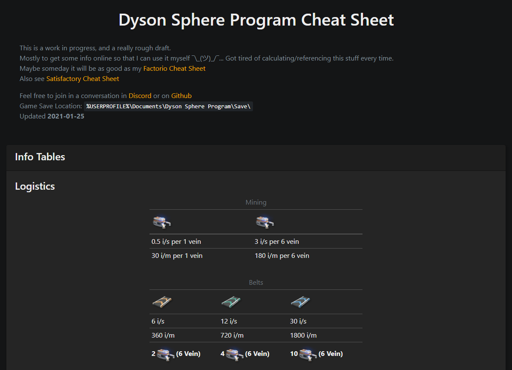

# Dyson Sphere Program [Cheat Sheet App](https://deniszholob.github.io/dyson-sphere-program-cheat-sheet/)
Cheat Sheet for [Dyson Sphere Program](https://www.kickstarter.com/projects/youthcat/dyson-sphere-programa-space-sci-fi-sandbox-game-0) game: *"A compendium of the most common Dyson Sphere Program game facts, such as build ratios, tips/tricks, and links to further information".*

## Deployments 

* [Master Deployment](https://deniszholob.github.io/dyson-sphere-program-cheat-sheet/)
* Master branch is for the source code that's hosted [here](https://deniszholob.github.io/dyson-sphere-program-cheat-sheet/).

# Support Me
If you find the cheat sheet or the source code useful, consider:

* Donating Ko-fi: https://ko-fi.com/deniszholob
* Supporting on Patreon: https://www.patreon.com/deniszholob

# Screenshots

